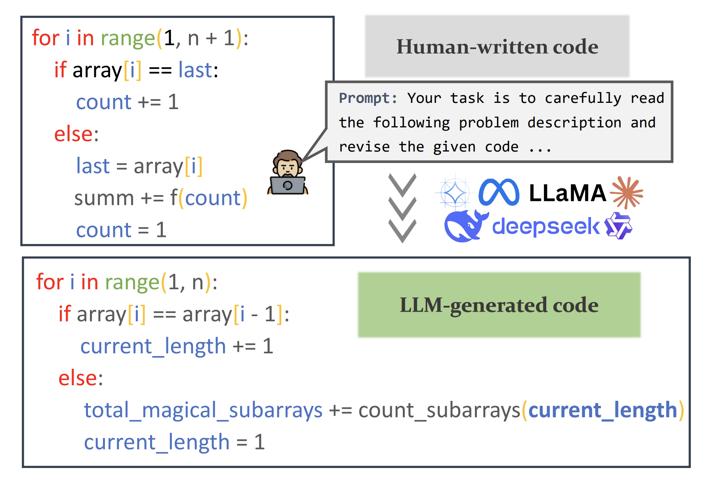
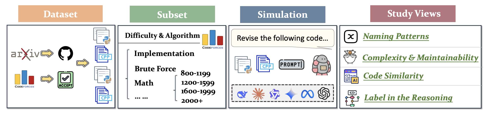
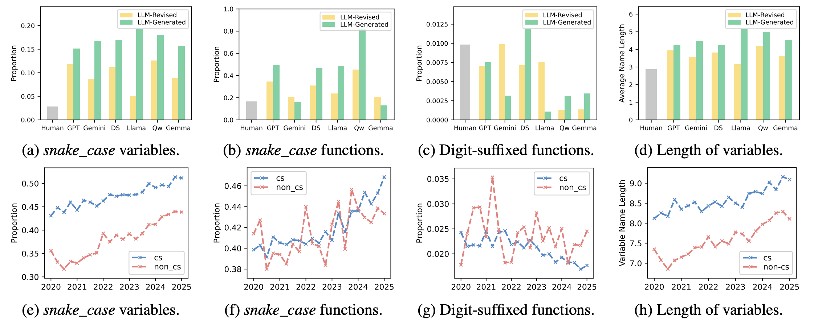
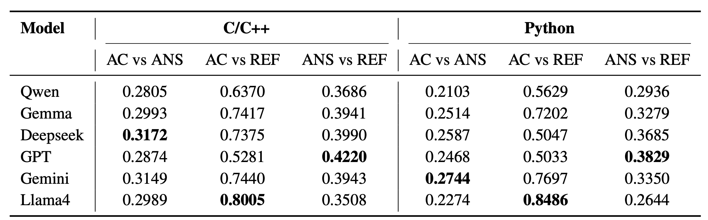
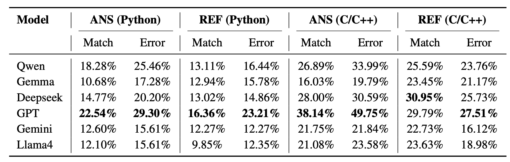

# code_transformed: The Influence of Large Language Models on Code

<!--  -->

## Naming Patterns

> [!IMPORTANT]
> The coding style of human-written code may be influenced by LLMs: they may not only mirror existing norms but also subtly reshape them, gradually pushing human developers toward greater stylistic alignment with LLM-preferred conventions.

## Complexity and Maintainability

> [!IMPORTANT]
> LLM's code writing has lower complexity and higher maintainability than humans in the scenario of IO algorithm problems. At the same time, the output is stable, and its rewritten code indicators are inferior to direct generation.

## Code Similarity

> [!IMPORTANT]
> LLMs can effectively mimic human coding style when given reference code, but without such guidance, their generated solutions diverge significantly from human-written code—especially in IO algorithm tasks.

## Labels in the Reasoning Process

> [!IMPORTANT]
> LLMs have low algorithm analysis capabilities, are more inclined to approach C/C++ code from an algorithmic perspective, and harder problems may better activate their algorithmic reasoning capabilities.

## arxiv_dataset

The github repository of the arxiv dataset we collected (python files).

<pre>
├── 2020                   // The year  
	├── Q1                 // The quarter
		├──repo_name
			├──xxx.py      // Python file of the project
			... ...
			├──time_info.txt  // The time information of the file text
	... ...
... ...
</pre>

## arxiv_dataset_cpp

The github repository of the arxiv dataset we collected (C/C++ files).

<pre>
├── 2020             						// The year  
	├── Q1            						// The quarter
		├── repo_name
			├── xxx.cpp					// C/C++ file of the project
			 ... ...
			├── time_info.txt         // The time information of the file text
	 ... ...
 ... ...
</pre>

## arxiv_result

  
Here are the results and code of our analysis of the arxiv dataset.

<pre>
├── code                                // Our code for analyze
├── comments                      // Anayze on comments
├── github_links                   // Links of our collected dataset
├── naming_patterns_cpp  // Anayze on naming patterns (c/c++ files)
├── naming_patterns_py    // Anayze on naming patterns (python files)
├── old_output_by_year     //  Old results
</pre>

## codeforces

  
Here are the results and code of our analysis of the codeforce dataset.

<pre>
├── code     								// Our code for analyze  
	├── data_processing
	├── label
		├── caltag.py                  // Calculate frequency of each tag
		├── getalltags.py            // Get tags from codeforces
		├── gettags.py                // Calculate match and error cases for each output
		├── matchcal.py             // Arrange match and error result
	├── metrics
		├── cal.py                        // Calculate each metric's result of python code
		├── cal0.py                      // Calculate each metric's result of model's code (python)
		├── calc.py                      // Calculate each metric's result of C/C++ code
		├── calcpp.py                 // Calculate each metric's result of model's code (C/C++)
		├── calgitpy.py               // Calculate each metric's result of github dataset (python)
		├── calgitcpp.py             // Calculate each metric's result of github dataset (C/C++)
	├── sim
		├── calcos.py              // Calculate Cosine similarity
		├── caljac.py               // Calculate Jaccard similarity
	├── subset_select
├── label                                  // Result of Algorithm Tags
	├── codeforces_tags_frequency.csv       // The tags frequency of the problems
	├── tags_frequencies.csv                         // The tags frequency of the models' output
	├── tags_frequencies_count.csv             // The tags frequency of the models' output (count one in one output)
	├── tags_py.jsonl                                        // Tags of every python problems
	├── tags_cpp.jsonl                                      // Tags of every C/C++ problems
	├── qwen32b_cpp_ans_match_report.csv  // model_lang_type_(match or error)_report.csv means match and error cases of every problems in the models' output 
	 ... ...
├── metrics                             // Scoring indicator results
	├──  benchmark                 // Code4bench dataset result
		├── qwen_AC_cpp.csv            // model_type_lang.csv means the metric result of the model
		 ... ...
	├──  subset                          // Subset result
		├── subset_metrics.csv          // Arranged result
		├── models_code
			├── claude_standard_cpp.jsonl  // model_lang.jsonl means the output of the model on subset
			 ... ...
		├── subset_metrics
			├── claude_standard_cpp.csv   // model_lang.csv means the result of the model on subset
			 ... ...
├── models_code
├── naming_patterns
├── similar                              // Result of similarity
	├── qwen_32b_cpp_sim_cosine.csv  // model_lang_sim_type.csv means the similarity result of the model
	 ... ...
├── simulation
</pre>