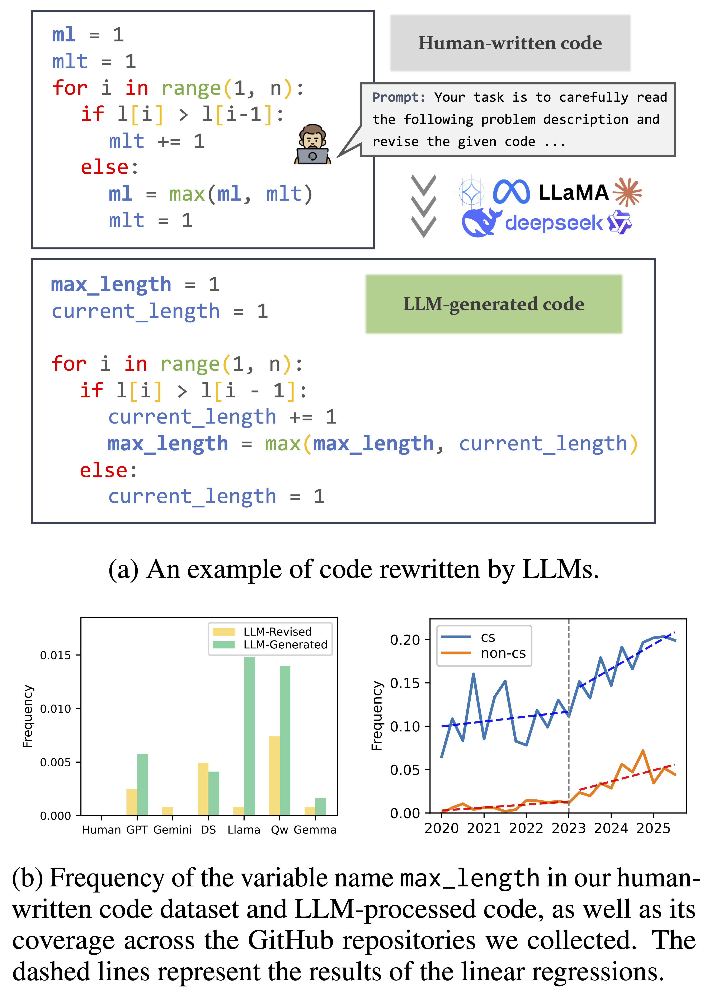
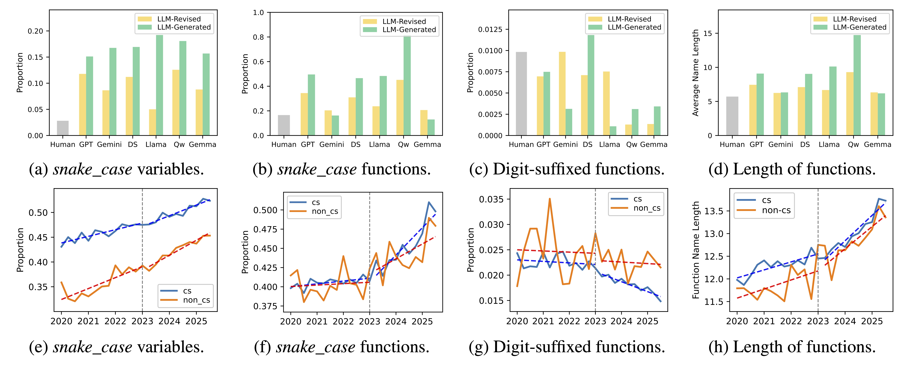
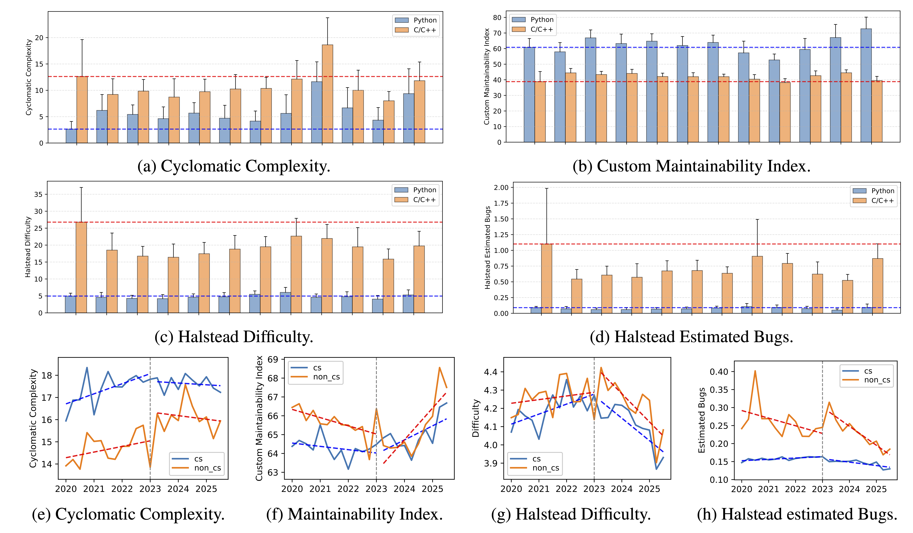

<div align="center">
<h1><em>code_transformed</em>: <br>The Influence of Large Language Models on Code</h1>



<p align="center">

</p>
</div>

## Contents

- [Contents](#contents)
- [Data Collection](#data-collection)
  - [GitHub Data](#github-data)
  - [Human-Written Code](#human-written-code)
- [Naming Patterns](#naming-patterns)
- [Complexity and Maintainability](#complexity-and-maintainability)
- [Code Similarity](#code-similarity)
- [Labels in the Reasoning Process](#labels-in-the-reasoning-process)
- [Citation](#citation)

## Data Collection

### GitHub Data

**We collect a total of 19,898 GitHub repositories and 926,935 source code files, corresponding to arXiv papers from the first quarter of 2020 to the first quarter of 2025.** Our arXiv dataset is organized across two GitHub repositories: Python files are in `LLM_code/arxiv_dataset`, and C/C++ code is in `LLM_code/arxiv_dataset_cpp`.

```
├── 2020                   // Year
    ├── Q1                 // Quarter
        ├── repo_name      // Repository name
            ├── xxx.py     // Project Python file
            ...
            ├── time_info.txt  // File creation/modification time information
```

### Human-Written Code

We utilize _Code4Bench_, a multidimensional benchmark based on Codeforces data. This dataset contains user submissions on Codeforces before 2020, which were barely impacted by LLMs. We generate code using LLMs with various prompting strategies.

## Naming Patterns

we categorize variable, function, and file names into several distinct formats (e.g. _snake_case_). The length of the names has also been considered.



> [!IMPORTANT] > **_Finding 1_: The coding style of human-written code may be influenced by LLMs: they may not only mirror existing norms but also subtly reshape them, gradually pushing human developers toward greater stylistic alignment with LLM-preferred conventions.**

## Complexity and Maintainability

Cyclomatic complexity is a metric used to measure the number of linearly independent paths in the code.

<div align="center">

<p align="center">

</p>
</div>

> [!IMPORTANT] > **_Finding 2_: For I/O algorithm problems, LLM-generated code tends to exhibit higher maintainability, lower difficulty, and fewer bugs than human-written solutions, which aligns with the evolution of Github code after 2023Q1. Moreover, the quality of reference-guided code is generally inferior to that of directly generated code.**

## Code Similarity

We compare three versions of each problem’s code: the original human-authored solution (**AC**), the LLM’s output given only the problem description (**ANS**), and the LLM’s output when additionally conditioned on the human solution (**REF**). We compute **pairwise cosine and Jaccard similarities** among AC, ANS, and REF.


> [!IMPORTANT] > **_Finding 3_: LLMs can effectively mimic human coding style when given reference code, but without such guidance, their generated solutions diverge significantly from human-written code—especially in IO algorithm tasks.**

## Labels in the Reasoning Process

To further refine our analysis, we individually examine the matching of reasoning and labels for each question.

Let $T$ denote the set of all labels. For each question $q$, let $A_q \subseteq T$ be the set of true labels in the question description, and let $R_q \subseteq T$ be the set of labels in the reasoning process.

We then define the $\mathrm{match}$ and $\mathrm{error}$ metrics as follows:

$$
\begin{align}
\mathrm{match}(q) &= \mathbf{1}\left( A_q \cap R_q \ne \varnothing \right), \\
\mathrm{error}(q) &= \mathbf{1}\left( \left( T \setminus A_q \right) \cap R_q \ne \varnothing \right),
\end{align}
$$

where $\mathbf{1}(\cdot)$ is the indicator function: it returns 1 if the condition is met, and 0 otherwise.


> [!IMPORTANT] > **_Finding 4_: LLMs have low algorithm analysis capabilities, are more inclined to approach C/C++ code from an algorithmic perspective, and harder problems may better activate their algorithmic reasoning capabilities.**

## Citation

```
@article{xu2025code_transformed,
  title={code\_transformed: The Influence of Large Language Models on Code},
  author={Xu, Yuliang and Huang, Siming and Geng, Mingmeng and Wan, Yao and Shi, Xuanhua and Chen, Dongping},
  journal={arXiv preprint arXiv:2506.12014},
  year={2025}
}
```

<!--
```
├── code     								// Our code for analyze
	├── data_processing
	├── label
		├── caltag.py                  // Calculate frequency of each tag
		├── getalltags.py            // Get tags from codeforces
		├── gettags.py                // Calculate match and error cases for each output
		├── matchcal.py             // Arrange match and error result
	├── metrics
		├── cal.py                        // Calculate each metric's result of python code
		├── cal0.py                      // Calculate each metric's result of model's code (python)
		├── calc.py                      // Calculate each metric's result of C/C++ code
		├── calcpp.py                 // Calculate each metric's result of model's code (C/C++)
		├── calgitpy.py               // Calculate each metric's result of github dataset (python)
		├── calgitcpp.py             // Calculate each metric's result of github dataset (C/C++)
	├── sim
		├── calcos.py              // Calculate Cosine similarity
		├── caljac.py               // Calculate Jaccard similarity
	├── subset_select
├── label                                  // Result of Algorithm Tags
	├── codeforces_tags_frequency.csv       // The tags frequency of the problems
	├── tags_frequencies.csv                         // The tags frequency of the models' output
	├── tags_frequencies_count.csv             // The tags frequency of the models' output (count one in one output)
	├── tags_py.jsonl                                        // Tags of every python problems
	├── tags_cpp.jsonl                                      // Tags of every C/C++ problems
	├── qwen32b_cpp_ans_match_report.csv  // model_lang_type_(match or error)_report.csv means match and error cases of every problems in the models' output
	 ... ...
├── metrics                             // Scoring indicator results
	├──  benchmark                 // Code4bench dataset result
		├── qwen_AC_cpp.csv            // model_type_lang.csv means the metric result of the model
		 ... ...
	├──  subset                          // Subset result
		├── subset_metrics.csv          // Arranged result
		├── models_code
			├── claude_standard_cpp.jsonl  // model_lang.jsonl means the output of the model on subset
			 ... ...
		├── subset_metrics
			├── claude_standard_cpp.csv   // model_lang.csv means the result of the model on subset
			 ... ...
├── models_code
├── naming_patterns
├── similar                              // Result of similarity
	├── qwen_32b_cpp_sim_cosine.csv  // model_lang_sim_type.csv means the similarity result of the model
	 ... ...
├── simulation
``` -->
